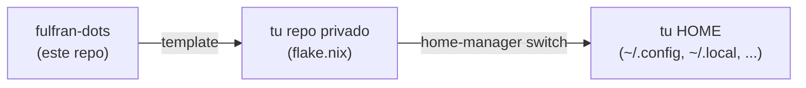

# fulfran-dots

## Si ya lo instalaste y se te rompió algo

Si la shell no abre o tu config fue sobreescrita, estos pasos te sacan del apuro:

**1. Recuperar la shell si no abre:**
```bash
exec /bin/zsh -f
# o con bash:
exec /bin/bash --norc
```

Si sigue sin abrir, agregar `FULFRAN_NO_TMUX=1` al entorno antes de abrir la terminal evita que se intente arrancar tmux.

**2. Recuperar archivos sobreescritos:**
```bash
ls ~/.config/                  # buscar archivos .backup
ls ~/ | grep backup            # buscar en HOME
# Ejemplo para tmux:
mv ~/.config/tmux/tmux.conf.backup ~/.config/tmux/tmux.conf
```

**3. Volver a una generación anterior de home-manager:**
```bash
nix run github:nix-community/home-manager -- generations
nix run github:nix-community/home-manager -- rollback
# o activar una generación específica:
# /nix/store/<hash>-home-manager-generation/activate
```

**4. Si el flake ya no evalúa:**
```bash
nix flake check --no-write-lock-file
nix flake update
```

---

> Base reutilizable de configuraciones (tmux, ghostty, neovim, shell, dev tools) en Nix + home-manager. Para que tu equipo levante el mismo entorno en 5 minutos.

---

## ¿Esto qué es?

**home-manager** es un gestor de la home directory: declará qué querés tener instalado y configurado, y él lo aplica de forma reproducible — sin tocar el sistema operativo ni romper nada.

**Nix** es el gestor de paquetes que hace posible eso: cada paquete vive aislado, podés hacer rollback inmediato si algo sale mal, y el entorno queda idéntico en cualquier máquina (Linux, macOS Intel, Apple Silicon).

**fulfran-dots** te da los módulos listos para usar: tmux + ghostty + neovim (LazyVim) + bash/zsh + dev tools. Usás lo que necesitás, deshabilitas lo que no, todo desde tu repo privado.



---

## Inicio rápido (5 minutos)

### 1. Instala Nix

#### Linux
```bash
curl --proto '=https' --tlsv1.2 -sSf -L https://install.determinate.systems/nix | sh -s -- install
```

#### macOS (Intel o Apple Silicon)
```bash
curl --proto '=https' --tlsv1.2 -sSf -L https://install.determinate.systems/nix | sh -s -- install
```

El mismo comando funciona en ambos. El instalador detecta la arquitectura automáticamente.

Abrí una terminal nueva cuando termine. Verificá:
```bash
nix --version
# nix (Nix) 2.x.x
```

### 2. Habilitá flakes (si Determinate no lo hizo)

```bash
mkdir -p ~/.config/nix
echo 'experimental-features = nix-command flakes' >> ~/.config/nix/nix.conf
```

### 3. Inicializá tu repo privado desde el template

```bash
mkdir ~/mis-dotfiles && cd ~/mis-dotfiles
nix flake init -t github:FullFran/fulfran-dots
```

Esto crea un `flake.nix` con `fulfran-dots` como input, un `hosts/example.nix` y un README de bienvenida.

### 4. Corre el TUI para registrar tu máquina

```bash
nix run github:FullFran/fulfran-dots#tui
```

El TUI te pregunta:
- Qué preset querés (`full` para empezar, ver tabla abajo)
- Tu hostname (lo sanitiza a minúsculas con guiones)
- Tu usuario (default: tu `$USER`)

Escribe `hosts/<tu-host>.nix` y registra `<tu-user>@<tu-host>` en tu `flake.nix`.

### 5. Aplicá la config

```bash
nix run github:nix-community/home-manager -- switch --flake .#<tu-user>@<tu-host> -b backup
```

`-b backup` guarda los archivos previos con extensión `.backup`.

**Listo.** Abrí una terminal nueva y vas a tener:
- `tmux` con config Tokyo Night + plugins
- `nvim` con LazyVim
- `eza`, `bat`, `fd`, `ripgrep`, `fzf` con aliases listos
- `lazygit`, `btop`, `yazi`, `atuin`

---

## Notas por plataforma

### macOS

- **Ghostty**: el paquete Nix de ghostty es Linux-only. Instalalo desde [ghostty.org](https://ghostty.org) o vía Homebrew (`brew install --cask ghostty`). El módulo `terminal` deja la config en `~/.config/ghostty/config` y Ghostty la lee sin importar cómo lo instalaste.
- **Fuentes**: las Nerd Fonts se instalan en `~/.nix-profile/share/fonts`. macOS las detecta automáticamente. Si no aparecen en la terminal, abrí Font Book y arrastrá la carpeta.
- **Apple Silicon vs Intel**: el flake soporta `aarch64-darwin` y `x86_64-darwin`. Nix pone la arquitectura correcta solo.

### Linux (Pop!_OS, Ubuntu, Fedora, Arch, NixOS)

- En **NixOS**: todo funciona directo, incluyendo ghostty con GPU.
- En **non-NixOS con ghostty y GPU**: necesitás nixGL. En tu host privado:
  ```nix
  home.packages = [ pkgs.nixgl.nixGLIntel ];
  # y lanzás ghostty como: nixGLIntel ghostty
  ```
- **Arch / Fedora**: el instalador Determinate funciona igual que en Ubuntu.

---

## Presets disponibles

| Preset | Incluye | Cuándo usarlo |
|---|---|---|
| `minimal` | core + shell | Servidor o SSH sin GUI |
| `terminal-only` | core + shell + terminal | Solo tmux/ghostty/btop |
| `dev-only` | core + shell + editor + dev | Sin terminal (otra config tuya) |
| `full` | todo | Setup completo (recomendado) |

En tu `flake.nix` privado cambiás el preset así:

```nix
modules = [
  fulfran-dots.homeManagerModules.full   # <- cambiá `full` por el preset que querés
  ./hosts/mi-host.nix
];
```

---

## Personalización — los toggles `enableConfig`

Cada módulo expone toggles para que uses solo el paquete con tu propia config.

**Ejemplo**: querés `tmux` instalado pero con tu propio `.tmux.conf`:

```nix
# hosts/mi-host.nix
programs.fulfran.tmux.enableConfig = false;
home.file.".tmux.conf".source = ./mi-tmux.conf;
```

**Todos los toggles disponibles** (`options.nix`):

| Toggle | Default | Qué hace |
|---|---|---|
| `programs.fulfran.core.enable` | `true` | Instala los paquetes CLI base (git, gh, eza, bat, etc.) |
| `programs.fulfran.shell.enableBash` | `true` | Habilita el árbol bash modular |
| `programs.fulfran.shell.enableZsh` | `true` | Habilita el árbol zsh modular |
| `programs.fulfran.tmux.enableConfig` | `true` | Escribe la tmux.conf del módulo |
| `programs.fulfran.ghostty.enableConfig` | `true` | Escribe la ghostty config |
| `programs.fulfran.nvim.enableConfig` | `true` | Escribe la config LazyVim |
| `programs.fulfran.lazygit.enableConfig` | `true` | Escribe el tema lazygit |
| `programs.fulfran.btop.enableConfig` | `true` | Escribe la config btop |
| `programs.fulfran.dev.enableGitHelpers` | `true` | Instala la función `gwt()` en bash/zsh |
| `programs.fulfran.dev.enableJdk` | `false` | Instala JDK 21 |

---

## Actualizar a la última versión

```bash
cd ~/mis-dotfiles
nix flake update
nix run github:nix-community/home-manager -- switch --flake .#<tu-user>@<tu-host> -b backup
```

---

## Rollback si algo se rompe

```bash
# Listar generaciones anteriores
nix run github:nix-community/home-manager -- generations

# Volver a la generación anterior directamente
nix run github:nix-community/home-manager -- rollback
```

O activar una generación específica:
```bash
/nix/store/<hash>-home-manager-generation/activate
```

---

## Problemas comunes

| Síntoma | Solución |
|---|---|
| `flake input does not exist` | Corrés `nix flake update` y verificás que `inputs.fulfran-dots.url` apunte a `github:FullFran/fulfran-dots` |
| `home-manager: command not found` la primera vez | La primera vez usás `nix run github:nix-community/home-manager -- switch ...`; después de eso `home-manager` ya está en el PATH |
| Fuentes que no aparecen | Cerrá y abrí la terminal; en Linux ejecutá `fc-cache -f`; en macOS abrí Font Book |
| Ghostty sin GPU en Linux non-NixOS | Falta nixGL (ver Notas Linux arriba) |
| `error: attribute 'ghostty' missing` en macOS | Normal — ghostty es Linux-only en nixpkgs; instalalo vía [ghostty.org](https://ghostty.org) |

---

## ¿Qué hay en el repo?

```
fulfran-dots/
├── modules/          # los 5 módulos home-manager
│   ├── core/         # paquetes base (eza, bat, ripgrep, etc.)
│   ├── shell/        # bash + zsh modulares
│   ├── terminal/     # tmux + ghostty + btop + nerd fonts
│   ├── editor/       # neovim + LazyVim + lazygit + delta
│   └── dev/          # nodejs, pnpm, bun, go, yazi, direnv, git helpers
├── presets/          # combos predefinidos (minimal, full, dev-only, terminal-only)
├── templates/        # skeleton para `nix flake init -t`
├── tui/              # bootstrap interactivo
├── apps/             # entrypoints del flake (tui app)
└── scripts/          # gates de portabilidad
```

---

## Contribuir

PRs bienvenidos. La condición: nada de configs personales (paths absolutos, usuarios hardcodeados, herramientas privadas). El script `scripts/portability-check.sh` valida los gates — si lo rompés, no entra.

---

## Licencia

MIT — fork, modificá, redistribuí sin pedir permiso.
